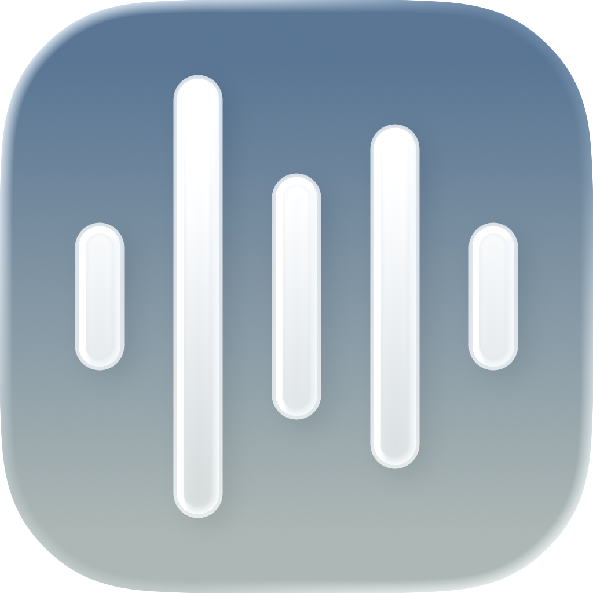

<p align="center">
  
</p>

<h1 align="center">Convene</h1>

<p align="center">
  An open-source Granola clone for macOS and iPhone. Records your meetings, transcribes them live, and writes the notes into a folder you own.
</p>

## What it does

On the Mac:

- Records both sides of a call: your mic and the other side's audio
- Transcribes live while the meeting runs, split by speaker
- Saves a Markdown note when you stop, with an AI summary and the full transcript
- Puts today's calendar in the menu bar. Click an event to join it and start recording
- Notices Zoom, Teams, Webex, Meet, and BlueJeans opening, and offers to record
- `⌥⇧R` records from anywhere, `⌥⇧K` flags a key moment mid-meeting
- Keys stay in your Keychain, notes stay in your folder. There's no Convene server

On the iPhone, for the meetings that happen in a room instead of on a call:

- Put the phone on the table and tap record. It keeps going when the screen locks
- One mic hears everyone, so AssemblyAI's diarization splits the room into Speaker A, Speaker B, and so on
- Same note format, same summary, same key-moment flag — one tap instead of `⌥⇧K`
- Notes land in Convene's folder under On My iPhone in Files, or in an iCloud Drive folder you pick

## Install

### macOS

Needs macOS 15 (Sequoia) or later.

<strong><a href="https://github.com/mblode/convene/releases/latest">Download the latest release</a></strong>, or:

```bash
brew tap mblode/tap
brew install --cask convene
```

First launch asks for Microphone, Screen Recording (audio only, no video), Calendar, and Notifications. Convene updates itself from there.

### iPhone

There's no App Store build yet — the iPhone app is built from source. Needs iOS 17 or later, Xcode, and [XcodeGen](https://github.com/yonaskolb/XcodeGen) (`brew install xcodegen`).

```bash
make ios-run          # build and launch in the simulator
make project          # regenerate Convene.xcodeproj, then open it to run on your phone
```

To run it on a real phone, open `Convene.xcodeproj`, pick the **ConveneMobile** scheme, and set your own team under Signing & Capabilities. Recording needs a device — the simulator has no microphone worth transcribing.

## Keys

Add these in Settings. They're stored in your Keychain.

- **[AssemblyAI](https://www.assemblyai.com/dashboard/api-keys)** for transcription. Required.
- **[Anthropic](https://console.anthropic.com/settings/keys) or [OpenAI](https://platform.openai.com/api-keys)** for summaries. Optional, and Claude writes the better ones.

## Your notes

Pick a save folder and every meeting lands there as `2026-07-22 103128 - Standup - a1b2c3d4.md`: YAML frontmatter, the summary, your notes, key moments, then the timestamped transcript. Point it at an Obsidian vault and meetings show up there on their own.

The iPhone app writes the same files. It defaults to Convene's own folder — visible in Files under On My iPhone — and you can point it at an iCloud Drive folder instead, which is the simplest way to get phone recordings onto the same Mac.

## License

MIT

---

Crafted by [](https://blode.co) [Matthew Blode](https://blode.co)
